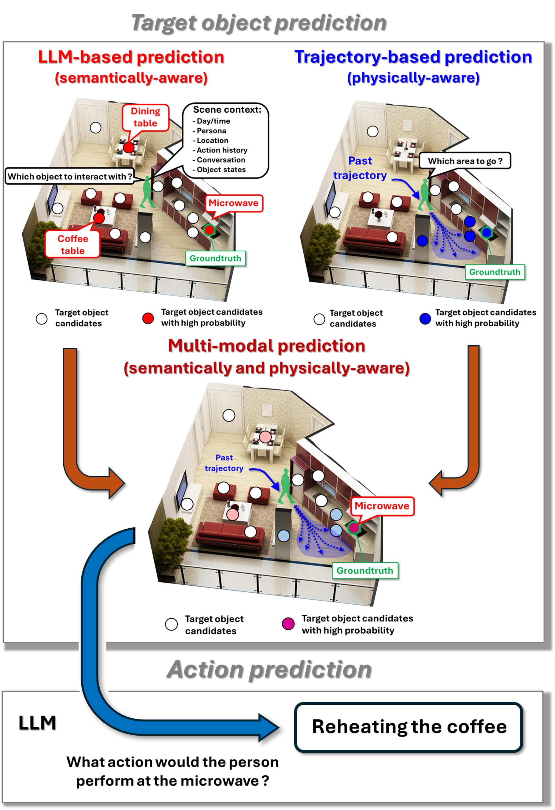

# TR-LLM: Integrating Trajectory Data for Scene-Aware LLM-Based Human Action Prediction

We present a multi-modal human action prediction framework that incorporates both an LLM and human trajectories. The core idea is to integrate two different perspectives—physical and semantic factors—through an object-based action prediction framework to reduce uncertainties and enhance action prediction accuracy. This github repo provides codes and evaluation data to test our model.

[Project website](https://sites.google.com/view/tr-llm/%E3%83%9B%E3%83%BC%E3%83%A0)
[arxiv paper](https://arxiv.org/abs/2410.03993)

<div align="center">

</div>

## Quick start
Quick visualization of the trajectories contained in LocoVR is done by the following instructions.

1. Download github repo

3. Download model
Download the foloder "vrlocomotion_models_000" from [this link](https://drive.google.com/drive/folders/1A9NCngHYVbUDx3M7P638edZfMieJlayY?usp=sharing) and unzip it, then place it in the top of "main" folder.
     
4. Install the packages in requirements.txt (python==3.8.1, cuda12.1):
```
pip install -r requirements.txt
```
5. Set API key and Organization code 
   Open setting.py in the main folder, and replace "*******" at API_KEY and ORGANIZATION with your original information.
   
6. Calculate
   Run TR-LLM.py, then it will generate results in "Result" folder.
```
python ./main/TR-LLM.py
```

7. Evaluate
   Run Evaluation.sh to get quantitative and qualitative evaluation results.
```
bash ./main/Evaluation.sh
```  

## Citation
If you find this repo useful for your research, please consider citing:
@article{takeyama2024tr,
  title={TR-LLM: Integrating Trajectory Data for Scene-Aware LLM-Based Human Action Prediction},
  author={Takeyama, Kojiro and Liu, Yimeng and Sra, Misha},
  journal={arXiv preprint arXiv:2410.03993},
  year={2024}
}

## License
This project is licensed under the MIT License
